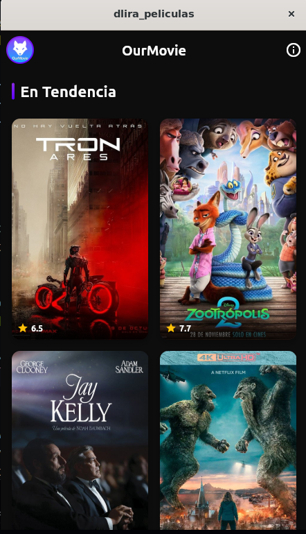
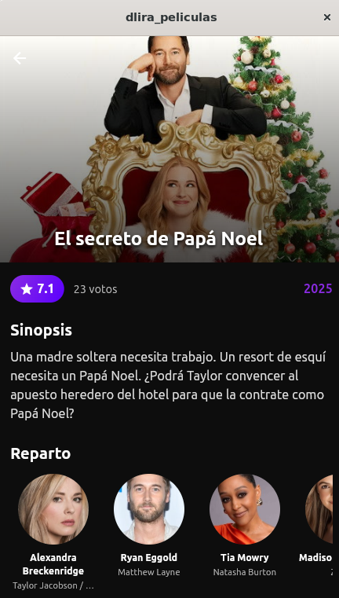
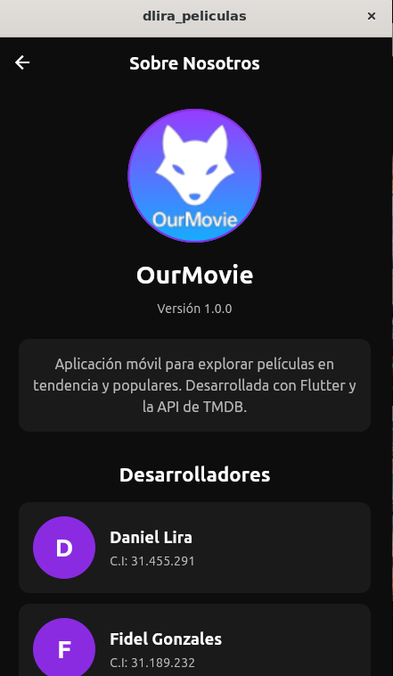
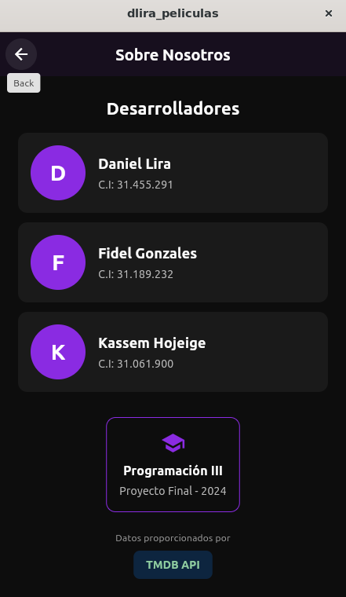

# OurMovie

**OurMovie** es una aplicación móvil diseñada para explorar, descubrir y organizar contenido cinematográfico y de series, utilizando la API de The Movie Database (TMDB).

## Concepto
El logo de OurMovie representa la silueta de un **zorro**, un animal asociado con astucia, exploración y curiosidad. Estos valores se alinean con la experiencia que ofrece la app: descubrir películas, explorar géneros y encontrar contenido nuevo de forma inteligente. El gradiente morado–azul refuerza la idea de modernidad, tecnología y entretenimiento digital.

## Identidad Visual

### Paleta de Colores
- **Primario**: Morado degradado (`#8A2BE2` → `#5B00FF`)
- **Secundario**: Blanco (`#FFFFFF`), Negro suave (`#0D0D0D`) y Gris claro (`#F2F2F2`)

### Tipografía
- **Principal**: Montserrat (o Sans Serif moderna)
- **Títulos**: Roboto Semibold, Bold y Black
- **Cuerpo**: Roboto Light, Regular y Medium

## Justificación del Diseño
- **Simplicidad**: Estructura limpia y organizada.
- **Modernidad**: Uso de gradientes y colores vibrantes.
- **Enfoque en el contenido**: Resalta posters y portadas.
- **Identidad consistente**: Cohesión visual en todas las pantallas.

## Características
- Navegar por películas populares, mejor valoradas y en tendencia.
- Explorar categorías por género.
- Buscar películas mediante un buscador dinámico.
- Visualizar detalles como poster, sinopsis, valoración y año de lanzamiento.
- Encontrar recomendaciones según sus intereses.

## Capturas de Pantalla

  
  

  
  

## Descargar APK
<!-- Inserta aquí el link de Google Drive -->
[Descargar APK](https://drive.google.com/file/d/1NJpI6XHknfZdnelPiGf-_HzhfOk0BQ5a/view?usp=sharing)

## Tecnologías
- Flutter
- Provider (Estado)
- HTTP (API TMDB)
- TMDB API

## Instalación
1. Clonar: `git clone https://github.com/tu-usuario/OurMovie.git`
2. Instalar: `flutter pub get`
3. Correr: `flutter run`

## Desarrolladores

- Daniel Lira - C.I: 31.455.291
- Fidel Gonzales - C.I: 31.189.232
- Kassem Hojeige - C.I: 31.061.900
## Materia

Programación III

Proyecto Final - 2024

## Licencia

Proyecto de uso educativo.
